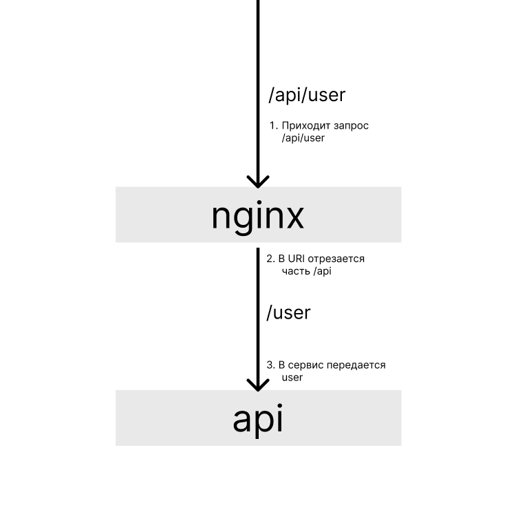

# nginx-proxy

Часто, вам придется настраивать перенаправление запроса на сервис который
запущен на локальной машине, либо на другом сервере.

Под одним доменом может быть запущена куча сервисов, от простой API до аналитики.
Для того чтобы объединить их в один домен, настраивают перенаправление запроса в
nginx. Например, запрос `https://jusan.kz/api/user/10` попадет на nginx сервер;
затем nginx отрезает часть `/api` и передает запрос на API как `jusan.kz/user/10`.

Передача запроса на сервис происходит следующим образом:



### Полезное

- [NGINX Reverse Proxy](https://docs.nginx.com/nginx/admin-guide/web-server/reverse-proxy/)
- [Проксирование запросов в nginx с помощью proxy_pass](https://serveradmin.ru/nginx-proxy_pass/)
- [Nginx reverse proxy + URL rewrite](https://serverfault.com/questions/379675/nginx-reverse-proxy-url-rewrite)

На сервере в качестве systemd сервиса запущена API на порту 9090.

### Задание

1. Добавьте `location /`, который обслуживает файл [index.html](https://stepik.org/media/attachments/lesson/686238/index.html).
2. Добавьте `location /api`, который удаляет `/api` из URI и перенаправляет запрос на `localhost:9090`.

Для проверки, сделайте следующий запрос:

```bash
$ curl http://localhost/api/
web-server: 0
```

---

### Ответ
```bash

aseke@aseke-ThinkPad-E14:/var/www/task-nginx$ curl http://localhost/api
<html>
<head><title>301 Moved Permanently</title></head>
<body>
<center><h1>301 Moved Permanently</h1></center>
<hr><center>nginx/1.27.2</center>
</body>
</html>
aseke@aseke-ThinkPad-E14:/var/www/task-nginx$ curl http://localhost/api/
<!DOCTYPE html>
<html lang="en">

<head>
    <meta charset="UTF-8">
    <meta http-equiv="X-UA-Compatible" content="IE=edge">
    <meta name="viewport" content="width=device-width, initial-scale=1.0">
    <title>Cats Page</title>
</head>

<body>
    <p>
    <h1>Cat with Flower</h1>
    
    </p>

    <p>
    <h1>Cat with Glasses</h1>
    
    </p>

    <p>
    <h1>Gray Cat</h1>
    
    </p>

    <p>
    <h1>Cats mafia</h1>
    
    </p>

    <p>
    <h1>Sleepy Cat</h1>
    
    </p>
</body>

</html>
aseke@aseke-ThinkPad-E14:/var/www/task-nginx$